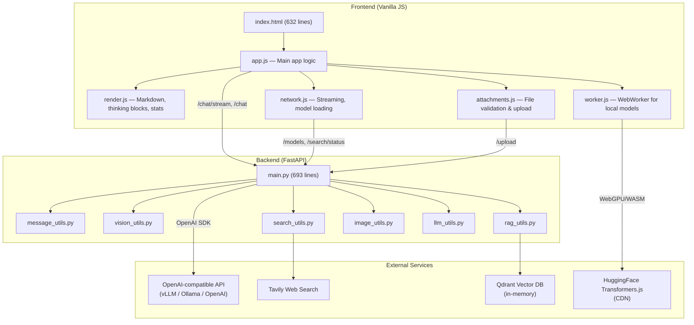

# LLMChat — Project Analysis

## Overview

**LLMChat** is a self-hosted ChatML interface built with **FastAPI** (backend) and **vanilla JS** (frontend). It integrates with any OpenAI-compatible API (vLLM, Ollama, OpenAI, etc.) and supports **RAG**, **web search**, **vision model detection**, and **in-browser local LLM inference** via WebGPU/WASM.

> [!NOTE]
> Originally named `simpleChatUI`, the project has grown from a basic frontend into a feature-rich LLM interface with 19 commits on `main`.

---

## Architecture



---

## Tech Stack

| Layer | Technology |
|:------|:-----------|
| Backend framework | FastAPI + Uvicorn |
| LLM client | `openai` Python SDK (v1+) |
| RAG embeddings | `sentence-transformers` (all-MiniLM-L6-v2, 384-dim) |
| RAG vector store | Qdrant (in-memory client) |
| PDF extraction | PyMuPDF (`fitz`) |
| Web search | Tavily API |
| Image processing | Pillow |
| Frontend | Vanilla HTML/CSS/JS |
| Markdown rendering | marked.js + DOMPurify + highlight.js |
| Local inference | HuggingFace Transformers.js (WebGPU + WASM) |

---

## Key Features

### 1. Multi-Provider LLM Support
- Connects to **any OpenAI-compatible endpoint** via `OPENAI_API_BASE`
- Both **streaming** (`/chat/stream` via SSE) and **non-streaming** (`/chat`) modes
- Auto-retries with reduced `max_tokens` when context length errors are detected ([llm_utils.py](file:///Users/kukilk/Downloads/Repositories/Personal/LLMChat/app/utils/llm_utils.py))

### 2. Vision Model Detection
- **Auto-probing**: Sends a test payload to detect if a model supports `image_url` content ([vision_utils.py](file:///Users/kukilk/Downloads/Repositories/Personal/LLMChat/app/utils/vision_utils.py))
- **Three-tier priority**: Per-request override → stored user override → probed capability
- Vision models get fewer history turns (2) vs text-only (10) to manage context

### 3. RAG Pipeline
- **Upload** → PDF text extraction → chunking (500 chars, 100 overlap) → embedding → Qdrant indexing
- **Search** → Query embedding → top-k similarity → injected as context into the system prompt
- Full CRUD: upload, list, search, delete documents ([rag_utils.py](file:///Users/kukilk/Downloads/Repositories/Personal/LLMChat/app/utils/rag_utils.py))

### 4. Web Search Integration
- Tavily API integration with direct answer extraction + top-5 results
- Results injected into the system prompt as context ([search_utils.py](file:///Users/kukilk/Downloads/Repositories/Personal/LLMChat/app/utils/search_utils.py))
- Graceful degradation: returns empty string if unconfigured

### 5. In-Browser Local Inference
- **WebWorker** architecture for non-blocking UI ([worker.js](file:///Users/kukilk/Downloads/Repositories/Personal/LLMChat/app/static/worker.js))
- Supported local models:
  - 💻 TinyLlama 1.1B (WASM)
  - 💻 Phi-3 mini 4K (WASM)
  - 🚀 Llama 3.2 1B (WebGPU, q4)
  - 🚀 SmolLM2 360M (WebGPU, q4)
  - 🚀 Gemma 3 1B (WebGPU, q4)
- Auto-detects WebGPU availability; falls back to WASM

### 6. Thinking/Reasoning Block Support
- Parses `<think>...</think>` tags from model output
- Renders as collapsible "💭 Model's Reasoning" sections in the UI ([render.js](file:///Users/kukilk/Downloads/Repositories/Personal/LLMChat/app/static/render.js))

---

## API Endpoints

| Method | Path | Purpose |
|:-------|:-----|:--------|
| `GET` | `/` | Serve [index.html](file:///Users/kukilk/Downloads/Repositories/Personal/LLMChat/app/index.html) |
| `POST` | `/chat` | Non-streaming chat completion |
| `POST` | `/chat/stream` | SSE streaming chat completion |
| `GET` | `/models` | List available models + vision caps |
| `POST` | `/upload` | File upload (images, text, PDF) |
| `POST` | `/web-search` | Standalone web search |
| `GET` | `/search/status` | Check Tavily availability |
| `POST` | `/rag/upload` | Upload & index PDF for RAG |
| `GET` | `/rag/documents/{user_id}` | List indexed documents |
| `DELETE` | `/rag/documents/{doc_id}` | Delete indexed document |
| `POST` | `/rag/search` | Search indexed documents |
| `GET` | `/rag/status` | RAG system health check |
| `POST` | `/reset` | Clear chat history |
| `POST` | `/vision/override` | Set vision capability override |
| `GET` | `/vision/override` | Get vision capability override |

---

## File Structure

```
LLMChat/
├── app/
│   ├── .env.example          # API keys template
│   ├── index.html             # Main UI (632 lines)
│   ├── main.py                # FastAPI app (693 lines, 39 functions/classes)
│   ├── requirements.txt       # Python deps (10 packages)
│   ├── static/
│   │   ├── app.js             # Main app logic (463 lines)
│   │   ├── render.js          # Rendering: markdown, thinking, stats (204 lines)
│   │   ├── network.js         # Models, streaming, web search (135 lines)
│   │   ├── attachments.js     # File validation & uploads (62 lines)
│   │   └── worker.js          # WebWorker for local LLMs (194 lines)
│   └── utils/
│       ├── __init__.py        # Package exports
│       ├── rag_utils.py       # RAG pipeline (321 lines)
│       ├── message_utils.py   # Message building (275 lines)
│       ├── vision_utils.py    # Vision detection (202 lines)
│       ├── search_utils.py    # Web search (55 lines)
│       ├── image_utils.py     # Image compression (78 lines)
│       └── llm_utils.py       # Token parsing (35 lines)
├── tests/                     # Test screenshots only (no automated tests)
├── LICENSE                    # GPL-3.0
└── README.md
```

---

## Observations

> [!TIP]
> **Strengths:**
> - Clean separation of concerns — utilities are well-modularized
> - Frontend JS uses IIFE pattern to avoid global namespace pollution
> - Vision capability auto-detection is a thoughtful UX enhancement
> - WebGPU local inference is a standout feature for privacy-conscious users

> [!WARNING]
> **Areas for improvement:**
> - **No automated tests** — the [tests/](file:///Users/kukilk/Downloads/Repositories/Personal/LLMChat/tests) directory contains only screenshots
> - **In-memory state** — chat history (`chat_histories`), vision overrides, and RAG metadata are lost on restart
> - **CORS is wide open** (`allow_origins=["*"]`) — noted as needing tightening for production
> - **Known bug**: Image compression can fail for very large images (noted in code)
> - **No authentication/authorization** — `user_id` is client-supplied with no verification
> - Some duplicate code between [app.js](file:///Users/kukilk/Downloads/Repositories/Personal/LLMChat/app/static/app.js) and the modular JS files (legacy from restructuring)
